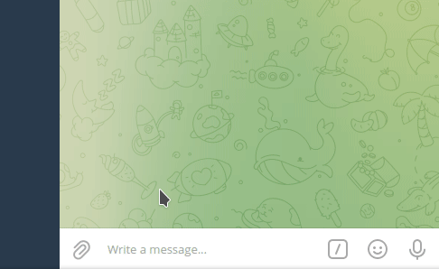
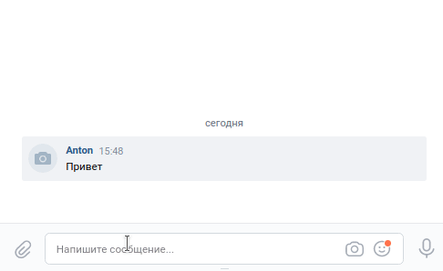

# Боты на основе технологии DialogFlow от Google.

### 1. Telegram бот

1.1. Делаем все под Python 3.9.  
1.2. Не забываем про зависимости: 
```shell
pip install -r requirements.txt 
```
1.3. Обязательно создаем файл `.env`, без него, как без воздуха: 
```text
# Токен вашего Telegram бота
TELEGRAM-TOKEN=

# ID вашего проекта DialogFlow
DIALOG-PROJECT-ID=

# Полученный файл с ключами от Google
GOOGLE_APPLICATION_CREDENTIALS=

# Имя json файла с вопросами и ответами (п.1.4)
BASE_QA_FILENAME=

# На каком языке вы будете говорить с ботом?
LANGUAGE=ru

# Токен вашего VK.com бота
VK-TOKEN=

# Токен и ID Телеграм бота для мониторинга.
TELEGRAM-LOG-TOKEN=
TELEGRAM-LOG-ID=
```
1.4. Ещё нам нужен файл с вопросами и ответами, на основании которого мы обучим нейросеть DialogFlow.
Содержимое файла `qa.json` (имя может быть любым) выглядит примерно так: 
```json
{
    "Приветствия": {
        "questions": [
            "Привет",
            "Добрый день",
            "Здравствуй",
            "Аллоха бот",
            "Hello",
            "Хай",
            "Здарова"
        ],
        "answer": [
            "Доброго времени суток",
            "Здравствуйте",
            "Приветствую Вас!"
        ]
    },
    "Как дела": {
        "questions": [
            "Как дела?",
            "Как жизнь?",
            "Что делаешь?"
        ],
        "answer": [
            "Все отлично! Бодр, полон сил и выспался!",
            "Покой нам только снится :). Работаю во благо человеков!",
            "В свободное время, грызу гранит науки. Чем помочь?"
        ]
    }
}
```
После создания пустой DialogFlow базы у вас всего лишь дефолтные вопросы/ответы (интенты) - это
приветствия и ответы, когда нейросеть вас не понимает.
Для того чтобы загрузить в нейросеть данные из вашего `qa.json` файла запустите следующую команду:
```shell
python base_renew.py
```
Скрипт удаляет все лишние интенты, если они есть и создает новые на основании `qa.json` файла.  
Он переспросит о вашей увереннности обновить базу и сообщит об ошибке, если не найдет `json` файл.

1.5. Скрипт Telegram бота очень короткий и всего с одним аргументом. Запускаем с помощью:

```shell
python bot_tg.py
```

А если что то незаладилось, включаем `DEBUG`: 
```shell
python bot_tg.py --debug=True
```
Результат примерно следующий:   
  

Попробуйте сами погонять, тестовый бот развернут на Heroku под именем [@DialogFlow_helper_bot](@DialogFlow_helper_bot)  


1.6 Очень полезно иметь под рукой: 

- [Отец ботов](https://telegram.me/BotFather)
- [Как создать проект в DialogFlow](https://cloud.google.com/dialogflow/docs/quick/setup)
- [Как создать Агента проекта DialogFlow](https://cloud.google.com/dialogflow/docs/quick/build-agent)
- [Создание JSON-ключа от Google](https://cloud.google.com/docs/authentication/getting-started)

### 2. VK.com бот
2.1. Выполните пункты 1.1-1.4, если они ещё не выполнены.  
2.2. Для группы ВКонтакте разрешите Сообщения и использование Ботов  
2.3. Запуск бота ВКонтакте такой-же простой:
```shell
python bot_vk.py
```

Если необходимо, включите `DEBUG`: 
```shell
python bot_vk.py --debug=True
```

После запуска вы получите примерно следующий результат:   


И этого бота можно проверить, тестовый бот развернут на Heroku 
для группы [DialogFlow_group](https://vk.com/club207174460)
